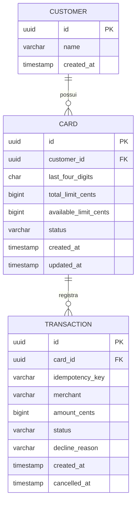

# Modelo de Dados

## Entidades e relacionamentos



## Customer

Representa o titular fictício de um ou mais cartões.

| Campo | Descrição |
|---|---|
| `id` | UUID do cliente |
| `name` | Nome fictício |
| `created_at` | Data e hora de criação |

O sistema não armazena CPF, endereço ou dados pessoais reais.

## Card

Representa o cartão fictício e controla seu limite.

| Campo | Descrição |
|---|---|
| `id` | UUID interno |
| `customer_id` | Cliente titular |
| `last_four_digits` | Quatro dígitos fictícios |
| `total_limit_cents` | Limite total em centavos |
| `available_limit_cents` | Limite disponível em centavos |
| `status` | `ACTIVE` ou `BLOCKED` |
| `created_at` | Data e hora de criação |
| `updated_at` | Data e hora da última alteração |

## Transaction

Representa uma tentativa de compra.

| Campo | Descrição |
|---|---|
| `id` | UUID da transação |
| `card_id` | Cartão utilizado |
| `idempotency_key` | Identificador da requisição |
| `merchant` | Estabelecimento fictício |
| `amount_cents` | Valor em centavos |
| `status` | `APPROVED`, `DECLINED` ou `CANCELLED` |
| `decline_reason` | Motivo da recusa, quando houver |
| `created_at` | Data e hora da tentativa |
| `cancelled_at` | Data e hora do cancelamento |

## Restrições

O PostgreSQL deverá proteger as invariantes principais:

```sql
CHECK (total_limit_cents > 0);
CHECK (available_limit_cents >= 0);
CHECK (available_limit_cents <= total_limit_cents);
CHECK (amount_cents > 0);
UNIQUE (card_id, idempotency_key);
```

## Chaves estrangeiras

```text
cards.customer_id → customers.id
transactions.card_id → cards.id
```

As chaves estrangeiras devem impedir registros associados a clientes ou cartões inexistentes.

## Índices

```text
cards.customer_id
transactions.card_id
transactions(card_id, created_at)
transactions(card_id, idempotency_key)
```

O índice composto de idempotência também sustenta a restrição de unicidade.

## Tipos monetários

Todos os valores monetários serão armazenados como números inteiros em centavos:

```text
R$ 159,90 = 15990 centavos
```

Essa decisão evita erros de precisão de ponto flutuante e simplifica comparações de limite.
