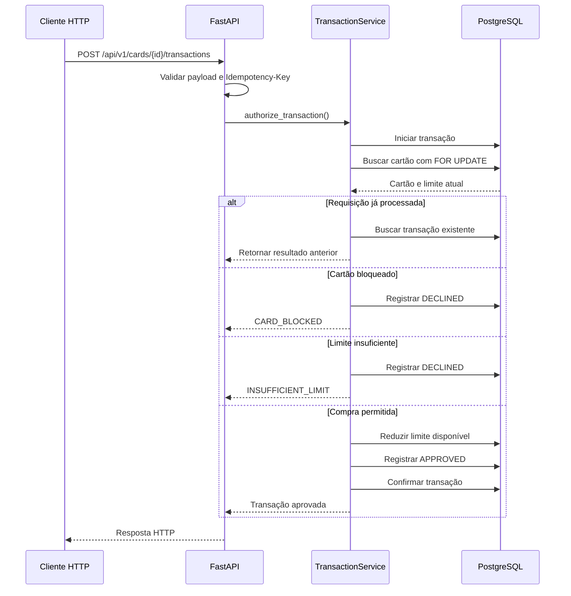
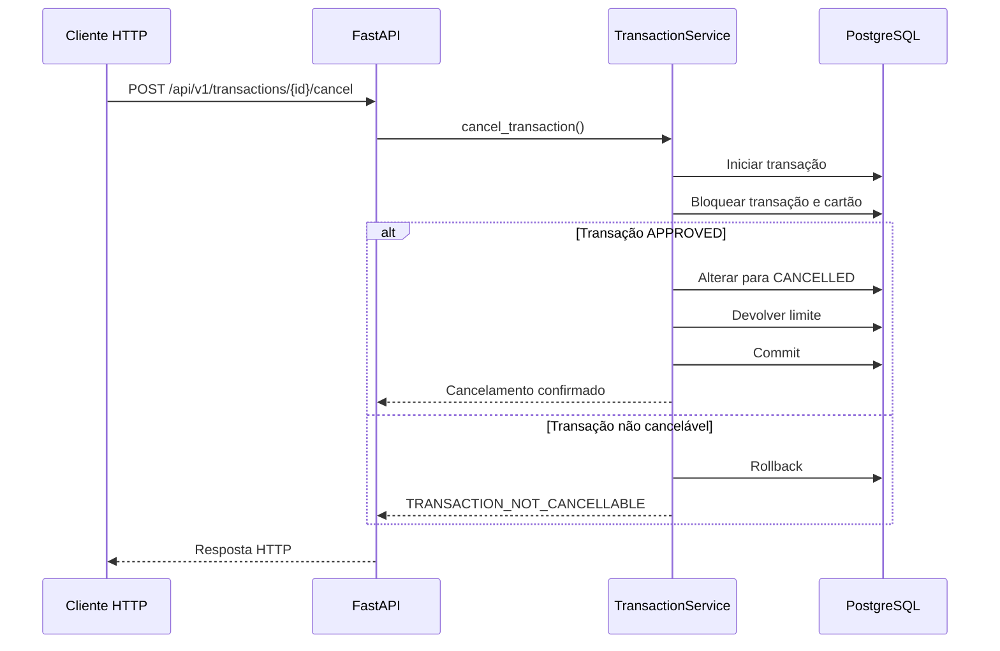

# Fluxos, Concorrência e Idempotência

## Autorização de uma compra



## Consistência e concorrência

A autorização precisa atualizar o limite e registrar a transação como uma única operação lógica.

O serviço deve iniciar uma transação no PostgreSQL e bloquear a linha do cartão:

```sql
SELECT *
FROM cards
WHERE id = :card_id
FOR UPDATE;
```

Enquanto a linha estiver bloqueada, outra transação que tente modificar o mesmo cartão deverá aguardar.

A sequência será:

1. Iniciar uma transação no banco.
2. Buscar o cartão com `FOR UPDATE`.
3. Verificar o status.
4. Verificar o limite disponível.
5. Atualizar o limite.
6. Registrar a transação.
7. Executar `COMMIT`.

Se qualquer etapa falhar, será executado `ROLLBACK`.

Essa estratégia evita:

- Limite reduzido sem transação registrada.
- Transação aprovada sem redução do limite.
- Duas compras simultâneas utilizando o mesmo saldo.

## Idempotência

Toda solicitação de compra deve possuir o cabeçalho:

```http
Idempotency-Key: 54068104-e063-4b93-9ecc-f58fe840ca34
```

A combinação entre cartão e chave será única:

```sql
UNIQUE (card_id, idempotency_key)
```

Quando uma chave já processada for recebida novamente, a aplicação deverá comparar o conteúdo da nova requisição com a operação original.

- Se o conteúdo for igual, o resultado original será retornado.
- Se o valor ou o estabelecimento for diferente, a API retornará um conflito.

A repetição nunca poderá criar uma nova transação ou reduzir novamente o limite.

## Cancelamento

O cancelamento deverá bloquear a transação e o cartão durante a operação.

A sequência será:

1. Buscar a transação.
2. Verificar se está aprovada.
3. Bloquear o cartão relacionado.
4. Alterar a transação para `CANCELLED`.
5. Devolver o valor ao limite disponível.
6. Registrar `cancelled_at`.
7. Confirmar as alterações.

O cancelamento e a devolução do limite devem ocorrer na mesma transação do banco.


