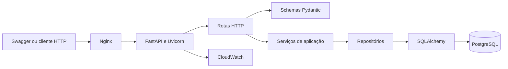
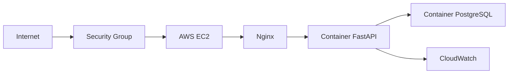

# Contexto do Sistema

## Estilo arquitetural

A aplicação utiliza um **monólito modular**.

Essa abordagem oferece separação clara entre responsabilidades sem introduzir a complexidade operacional de microsserviços. Os módulos principais são clientes, cartões e transações.

Cada módulo pode possuir rotas, schemas, serviços e repositórios próprios, mas todos são publicados como uma única aplicação.

## Diagrama de componentes

## Responsabilidades das camadas

### API e rotas

Responsáveis por:

- Receber requisições HTTP.
- Extrair parâmetros e cabeçalhos.
- Invocar os serviços da aplicação.
- Converter resultados em respostas HTTP.
- Informar os códigos de resposta apropriados.

As rotas não devem implementar regras de negócio.

### Schemas

Os schemas Pydantic são responsáveis por:

- Validar dados de entrada.
- Serializar dados de saída.
- Rejeitar formatos inválidos.
- Documentar os contratos no OpenAPI.

Os schemas não representam diretamente as tabelas do banco.

### Serviços

Os serviços concentram as regras de negócio, como:

- Validar se um cartão está ativo.
- Verificar limite disponível.
- Autorizar ou recusar uma compra.
- Cancelar uma transação.
- Coordenar alterações atômicas.

### Repositórios

Os repositórios isolam o acesso aos dados e são responsáveis por:

- Buscar clientes, cartões e transações.
- Persistir novas entidades.
- Atualizar registros.
- Executar consultas com bloqueio.
- Ocultar detalhes do SQLAlchemy dos serviços.

### Models

Os models SQLAlchemy representam as tabelas e seus relacionamentos. Também declaram chaves, índices e restrições estruturais.

### Banco de dados

O PostgreSQL é responsável pela persistência e por parte da integridade do domínio. O banco deve proteger invariantes importantes mesmo diante de uma falha no código da aplicação.

## Implantação inicial

Na primeira versão, FastAPI e PostgreSQL poderão executar em containers separados dentro da mesma instância EC2.

Essa decisão reduz custo e tempo de configuração, mas não representa a arquitetura recomendada para uma operação financeira real. Uma evolução futura poderá mover o PostgreSQL para o Amazon RDS.

## Segurança

A primeira versão deverá:

- Utilizar dados completamente fictícios.
- Armazenar somente quatro dígitos simulados do cartão.
- Manter segredos e arquivos `.env` fora do Git.
- Configurar o PostgreSQL sem acesso público.
- Restringir o acesso SSH por Security Group.
- Validar todos os dados recebidos.
- Não devolver detalhes internos nos erros.
- Executar containers sem privilégios desnecessários.

Autenticação e autorização não fazem parte do MVP inicial.
