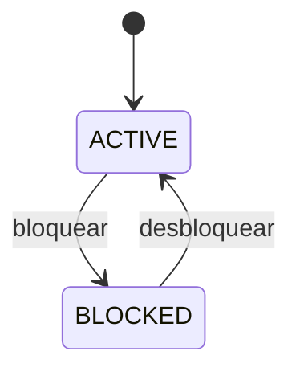
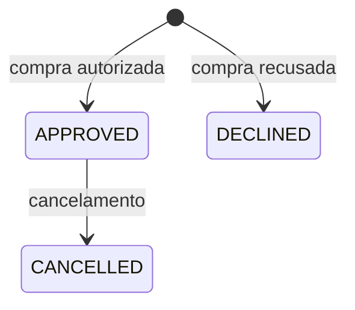

# Regras de Negócio

## 1. Objetivo

Este documento descreve as entidades, estados, invariantes e regras de negócio da API de cartões e controle de limite.

As regras aqui definidas devem orientar:

- Implementação dos serviços.
- Validações da API.
- Restrições do banco.
- Testes unitários.
- Testes de integração.

## 2. Glossário

### Cliente

Pessoa fictícia que possui um ou mais cartões.

### Cartão

Instrumento fictício que possui status, limite total e limite disponível.

### Limite total

Valor máximo configurado para o cartão.

### Limite disponível

Parte do limite que ainda pode ser utilizada.

### Transação

Tentativa de compra realizada com um cartão.

### Idempotência

Propriedade que garante que a repetição da mesma requisição não produza um segundo efeito.

## 3. Entidades

### Customer

Atributos:

- `id`
- `name`
- `created_at`

Relacionamentos:

- Um cliente pode possuir vários cartões.
- Um cartão pertence a apenas um cliente.

### Card

Atributos:

- `id`
- `customer_id`
- `last_four_digits`
- `total_limit_cents`
- `available_limit_cents`
- `status`
- `created_at`
- `updated_at`

Relacionamentos:

- Um cartão pertence a um cliente.
- Um cartão pode possuir várias transações.

### Transaction

Atributos:

- `id`
- `card_id`
- `idempotency_key`
- `merchant`
- `amount_cents`
- `status`
- `decline_reason`
- `created_at`
- `cancelled_at`

Relacionamentos:

- Uma transação pertence a apenas um cartão.

## 4. Estados

### Estados do cartão

- `ACTIVE`: permite novas compras.
- `BLOCKED`: recusa novas compras.



### Estados da transação

- `APPROVED`: compra autorizada e limite reduzido.
- `DECLINED`: compra recusada e limite preservado.
- `CANCELLED`: compra anteriormente aprovada e depois cancelada.



Transições não permitidas:

- `DECLINED` para `APPROVED`.
- `DECLINED` para `CANCELLED`.
- `CANCELLED` para `APPROVED`.
- `CANCELLED` para `DECLINED`.
- `CANCELLED` para `CANCELLED`.

## 5. Invariantes

As seguintes condições devem permanecer verdadeiras:

```text
total_limit_cents > 0
available_limit_cents >= 0
available_limit_cents <= total_limit_cents
transaction.amount_cents > 0
```

Valores monetários devem ser armazenados como inteiros em centavos:

```text
R$ 159,90 = 15990 centavos
```

## 6. Regras de cliente

### RN01 — Identificação do cliente

Todo cliente deve possuir um UUID único.

### RN02 — Nome obrigatório

O nome do cliente é obrigatório e não pode conter apenas espaços.

### RN03 — Dados fictícios

O sistema não deve exigir nem armazenar CPF, endereço ou outros dados pessoais reais.

## 7. Regras de cartão

### RN04 — Limite positivo

O limite total deve ser maior que zero.

### RN05 — Limite inicial

Ao criar um cartão:

```text
available_limit_cents = total_limit_cents
```

### RN06 — Limite disponível não negativo

O limite disponível nunca pode ser menor que zero.

### RN07 — Limite disponível máximo

O limite disponível não pode ser maior que o limite total.

### RN08 — Status inicial

Todo cartão deve ser criado com status `ACTIVE`.

### RN09 — Compra em cartão ativo

Somente cartões com status `ACTIVE` podem autorizar novas compras.

### RN10 — Bloqueio

Um cartão ativo pode ser alterado para `BLOCKED`. Bloquear um cartão não modifica transações anteriores nem devolve limite.

### RN11 — Desbloqueio

Um cartão bloqueado pode retornar ao status `ACTIVE`.

### RN12 — Dados de cartão

O sistema deve armazenar somente quatro dígitos fictícios. Não deve armazenar número completo, CVV, senha ou data de validade real.

## 8. Regras de transação

### RN13 — Valor positivo

O valor da compra deve ser maior que zero.

### RN14 — Estabelecimento obrigatório

O nome do estabelecimento é obrigatório e não pode conter apenas espaços.

### RN15 — Limite suficiente

Uma compra somente será aprovada quando:

```text
available_limit_cents >= amount_cents
```

### RN16 — Atualização do limite

Quando uma compra for aprovada:

```text
available_limit_cents = available_limit_cents - amount_cents
```

### RN17 — Compra recusada

Uma compra recusada não altera o limite disponível.

### RN18 — Registro das tentativas

Toda tentativa válida deve resultar em uma transação `APPROVED` ou `DECLINED`. Requisições estruturalmente inválidas podem ser rejeitadas antes da criação da transação.

### RN19 — Motivo da recusa

Uma transação `DECLINED` deve possuir um motivo:

- `CARD_BLOCKED`
- `INSUFFICIENT_LIMIT`

### RN20 — Atomicidade

A redução do limite e a criação da transação aprovada devem ocorrer na mesma transação do banco.

## 9. Regras de idempotência

### RN21 — Chave obrigatória

Toda tentativa de autorização deve possuir uma `Idempotency-Key`.

### RN22 — Escopo da chave

A combinação `card_id + idempotency_key` deve ser única.

### RN23 — Requisição repetida

Quando a mesma combinação for recebida novamente, o sistema deverá retornar o resultado original, sem reduzir novamente o limite ou criar outra transação.

### RN24 — Chave reutilizada com conteúdo diferente

Se a mesma chave for enviada para o mesmo cartão com valor ou estabelecimento diferente, a API deverá rejeitar a requisição com conflito.

## 10. Regras de cancelamento

### RN25 — Transação cancelável

Somente uma transação `APPROVED` pode ser cancelada.

### RN26 — Cancelamento único

Uma transação não pode ser cancelada mais de uma vez.

### RN27 — Devolução de limite

Ao cancelar uma transação aprovada:

```text
available_limit_cents = available_limit_cents + amount_cents
```

### RN28 — Atomicidade do cancelamento

A alteração para `CANCELLED` e a devolução do limite devem ocorrer na mesma transação do banco.

### RN29 — Data de cancelamento

Uma transação cancelada deve possuir `cancelled_at`. Transações aprovadas ou recusadas devem possuir `cancelled_at = null`.

### RN30 — Transação recusada

Uma transação `DECLINED` não pode ser cancelada porque seu valor nunca foi descontado.

## 11. Cenários mínimos de teste

### Cartão

- Criar cartão com limite válido.
- Rejeitar limite zero ou negativo.
- Consultar cartão existente.
- Retornar erro para cartão inexistente.
- Bloquear cartão ativo.
- Desbloquear cartão bloqueado.

### Autorização

- Aprovar compra com limite suficiente.
- Aprovar compra igual ao limite disponível.
- Reduzir corretamente o limite.
- Recusar compra acima do limite.
- Recusar compra com cartão bloqueado.
- Rejeitar valor zero ou negativo.
- Rejeitar estabelecimento vazio.

### Idempotência

- Repetir uma compra e retornar o resultado original.
- Confirmar que o limite foi reduzido uma única vez.
- Rejeitar chave reutilizada com payload diferente.

### Concorrência

- Executar duas compras simultâneas.
- Confirmar que o limite não fica negativo.
- Confirmar que somente operações compatíveis com o limite são aprovadas.

### Cancelamento

- Cancelar uma transação aprovada.
- Devolver corretamente o limite.
- Rejeitar segundo cancelamento.
- Rejeitar cancelamento de transação recusada.
- Rejeitar cancelamento de transação inexistente.

## 12. Rastreabilidade entre regras e testes

Os testes devem mencionar a regra correspondente quando isso melhorar a compreensão:

```python
def test_rn15_rejects_transaction_with_insufficient_limit():
    ...
```

A nomenclatura não é obrigatória para todos os testes, mas as regras críticas devem ser facilmente rastreáveis.
